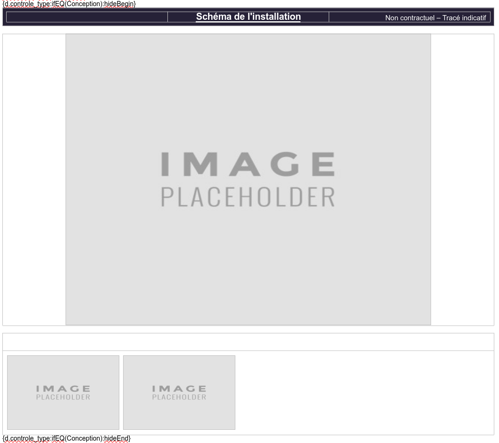
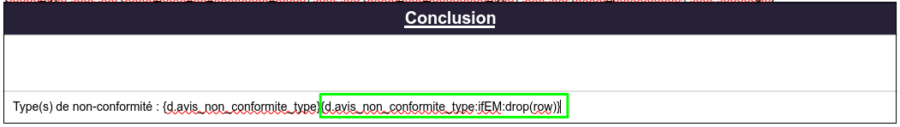

# Documentation template Carbone RnP

## [Lien documentation Carbone](https://carbone.io/documentation.html)

## Sommaire
- [Documentation template Carbone RnP](#documentation-template-carbone-rnp)
  - [Lien documentation Carbone](#lien-documentation-carbone)
  - [Sommaire](#sommaire)
  - [Appeler le JSon](#appeler-le-json)
  - [Conditions](#conditions)
    - [Particularité des chaines de caractères :](#particularité-des-chaines-de-caractères-)
    - [Valeurs vides : `ifEM()`](#valeurs-vides--ifem)
    - [Valeurs non vides : `ifNEM()`](#valeurs-non-vides--ifnem)
    - [Egalité : `ifEQ(valeur)`](#egalité--ifeqvaleur)
    - [Non égalité : `ifNE(valeur)`](#non-égalité--ifnevaleur)
    - [Supérieur : `ifGT(valeur)`](#supérieur--ifgtvaleur)
    - [Supérieur ou égal : `ifGTE(valeur)`](#supérieur-ou-égal--ifgtevaleur)
    - [Inférieur : `ifLT(valeur)`](#inférieur--ifltvaleur)
    - [Inférieur ou égal : `ifLTE(valeur)`](#inférieur-ou-égal--ifltevaleur)
    - [Contient : `ifIN(valeur)`](#contient--ifinvaleur)
    - [Ne contient pas : `ifNIN(valeur)`](#ne-contient-pas--ifninvaleur)
    - [Egalité type : `ifTE(valeur)`](#egalité-type--iftevaleur)
  - [Combiner des conditions](#combiner-des-conditions)
    - [Condition ET condition : `and(valeur)`](#condition-et-condition--andvaleur)
    - [Condition OU condition : `or(valeur)`](#condition-ou-condition--orvaleur)
  - [Affichage d'une valeur selon conditionnement](#affichage-dune-valeur-selon-conditionnement)
    - [Si condition vraie : `show(valeur)`](#si-condition-vraie--showvaleur)
    - [Si condition fausse : `elseShow(valeur)`](#si-condition-fausse--elseshowvaleur)
  - [Cacher / Supprimer un/des éléments selon conditionnement](#cacher--supprimer-undes-éléments-selon-conditionnement)
    - [Cacher selon condition : `hideBegin()` \& `hideEnd()`](#cacher-selon-condition--hidebegin--hideend)
    - [Supprimer selon condition : `drop(valeur)`](#supprimer-selon-condition--dropvaleur)
  - [Images](#images)
    - [Image fixe](#image-fixe)
    - [Image dynamique](#image-dynamique)
  - [Boucles](#boucles)
    - [Boucles sur un tableau](#boucles-sur-un-tableau)
    - [Boucles sur un objet](#boucles-sur-un-objet)
    - [Boucles sur des images](#boucles-sur-des-images)
    - [Set d'une variable](#set-dune-variable)

## Appeler le JSon

Example d'appel du JSon : `{d.variable}`

## Conditions

### Particularité des chaines de caractères :

- Si la chaine est un mot unique, les guillemets `''` ne sont pas nécessaires
- Sinon, les guillemets `''` sont nécessaires

### Valeurs vides : `ifEM()`

Disponible pour :
  - Chaines de caractères
  - Tableaux
  - Objets

Pas testé sur :
  - Entier ( 0 )
  - Booléen ( false )

Examples :
  - Chaine de caractères: `{d.string:ifEM()}`
  - Tableau : `{d.array:ifEM()}`

### Valeurs non vides : `ifNEM()`

Disponible pour :
  - Chaines de caractères
  - Tableaux
  - Objets

- Pas testé sur :
  - Entier ( 0 )
  - Booléen ( false )

Examples :
  - Chaine de caractères: `{d.string:ifNEM()}`
  - Tableau : `{d.array:ifNEM()}`

### Egalité : `ifEQ(valeur)`

Disponible pour :
  - Chaines de caractères
  - Entiers
  - Décimaux
  - Booléens

Pas testé sur :
  - Tableaux
  - Objets

Examples :
  - Entier : `{d.entier:ifEQ(5)}`
  - Chaine de caractères : `{d.string.ifEQ(test)}` ( pas besoin de guillemets pour des mots seuls )
  - Booléen : `{d.bool:ifEQ(true)}`

### Non égalité : `ifNE(valeur)`

Disponible pour :
  - Chaines de caractères
  - Entiers
  - Décimaux
  - Booléens

Pas testé sur :
  - Tableaux
  - Objets

Examples :
  - Entier : `{d.entier:ifNE(5)}`
  - Chaine de caractères : `{d.string.ifNE(test)}` ( pas besoin de guillemets pour des mots seuls )
  - Booléen : `{d.bool:ifEQ(true)}`

### Supérieur : `ifGT(valeur)`

Disponible pour :
  - Entiers
  - Décimaux

Examples :
  - Entier : `{d.entier:ifGT(5)}`
  - Decimal : `{d.decimal:ifGT(5.6)}`

### Supérieur ou égal : `ifGTE(valeur)`

Disponible pour :
  - Entiers
  - Décimaux

Examples :
  - Entier : `{d.entier:ifGTE(5)}`
  - Decimal : `{d.decimal:ifGTE(5.6)}`

### Inférieur : `ifLT(valeur)`

Disponible pour :
  - Entiers
  - Décimaux

Examples :
  - Entier : `{d.entier:ifLT(5)}`
  - Decimal : `{d.decimal:ifLT(5.6)}`

### Inférieur ou égal : `ifLTE(valeur)`

Disponible pour :
  - Entiers
  - Décimaux

Examples :
  - Entier : `{d.entier:ifLTE(5)}`
  - Decimal : `{d.decimal:ifLTE(5.6)}`

### Contient : `ifIN(valeur)`

Disponible pour :
  - Chaines de caractères
  - Tableaux

Examples :
  - Chaine de caractères : `{d.string:ifIN(Tic)}`
  - Tableau : `{d.array:ifIN(5)}` ou `{d.array:ifIN(Tic)}`

### Ne contient pas : `ifNIN(valeur)`

Disponible pour :
  - Chaines de caractères
  - Tableaux

Examples :
  - Chaine de caractères : `{d.string:ifNIN(Tic)}`
  - Tableau : `{d.array:ifNIN(5)}` ou `{d.array:ifNIN(Tic)}`

### Egalité type : `ifTE(valeur)`

Disponible pour :
  - Entiers
  - Décimaux
  - Chaines de caractères
  - Tableaux
  - Objets
  - Booléens

Examples :
  - Entier : `{d.entier:ifTE(integer)}`
  - Décimal : `{d.decimal:ifTE(number)}`
  - Chaine de caractères : `{d.string:ifTE(string)}`
  - Tableau : `{d.array:ifTE(array)}`
  - Objet : `{d.objet:ifTE(object)}`
  - Booléen : `{d.bool:ifTE(boolean)}`

## Combiner des conditions

### Condition ET condition : `and(valeur)`

Examples :
  - `{d.entier:ifEQ(5):and(.string):ifNEM()}`
  - `{d.string:ifEM:and(.decimal):ifGTE(5.6)}`

Particularité :
  - Dans le and(), `.` référence l'objet utilisé précédemment dans le conditionnement

### Condition OU condition : `or(valeur)`

Examples :
  - `{d.entier:ifEQ(5):or(.string):ifNEM()}`
  - `{d.string:ifEM:or(.decimal):ifGTE(5.6)}`

Particularité :
  - Dans le or(), `.` référence l'objet utilisé précédemment dans le conditionnement

## Affichage d'une valeur selon conditionnement

### Si condition vraie : `show(valeur)`

Examples :
  - Pour un entier valant 5 `{d.entier:ifEQ(5):show('Condition vraie')}` -> Affiche 'Condition vraie'
  - Pour une chaine de caractères 'Test': `{d.string:ifNEQ(Test):show('Condition vraie')}` -> Affiche 'Condition vraie'

### Si condition fausse : `elseShow(valeur)`

Examples :
  - Pour un entier valant 5 `{d.entier:ifEQ(4):show('Condition vraie'):elseShow('Condition Fausse')}` -> Affiche 'Condition fausse'
  - Pour une chaine de caractères 'Test': `{d.string:ifNEQ(Machine):show('Condition vraie'):elseShow('Condition fausse')}` -> Affiche 'Condition fausse'

## Cacher / Supprimer un/des éléments selon conditionnement

### Cacher selon condition : `hideBegin()` & `hideEnd()`

Utilisation :

`hideBegin()` & `hideEnd()` permettent de délimiter respectivement le début et la fin pour cacher les éléments entre ces balises

### Supprimer selon condition : `drop(valeur)`

Valeurs disponibles :
  - p : supprime un paragraphe
  - row : supprime une ligne d'un tableau
  - img : supprime une image
  - table : supprime un tableau
  - chart : supprime un graphique
  - shape : supprime une forme ( rond, carré, flèche, etc...)
  - slide : supprime une slide ( powerpoint )
  - item : supprime un point d'une liste à points

Utilisation :

`drop(valeur)` permet de supprimer un élément désigné par la valeur dans le drop

## Images

### Image fixe

Insérer l'image directement dans la template

### Image dynamique

Insérer une image qui sert de `placeholder` et lui définir une `largeur`.
Il suffit ensuite de se rendre dans les `propriétés` de l'image et renseigner la variable contenant l'url : `{d.lienPhoto}` dans `Texte alternatif`

## Boucles

### Boucles sur un tableau

Utilisation :

Pour un tableau : [1, 6, 4, 6, 5]

- `{d.tableau[i]}` `{d.tableau[i+1]}`
  - Résultat : 1 6 4 6 5

Pour un tableau : [ {id: 6, nom: 'Ate'}, {id: 4, nom: 'Test'}, {id: 7, 'Ldao'} ]

- `{d.tableau[i].nom}` `{d.tableau[i+1]}`
  - Résultat : Ate Test Ldao

Pour un tableau : [ {id: 6, nom: 'Ate'}, {id: 4, nom: 'Test'}, {id: 7, 'Ldao'} ]

- `{d.tableau[id].nom}` `{d.tableau[id+1]}`
  - Résultat : Test Ate Ldao

Filtrer :

Pour un tableau : [ {id: 6, nom: 'Ate'}, {id: 4, nom: 'Test'}, {id: 7, 'Ldao'} ]

- `{d.tableau[i, id>5].nom}` `{d.tableau[i+1, id>5]}`
  - Résultat : Ate Ldao

Pour un tableau : [ {id: 6, nom: 'Ate'}, {id: 4, nom: 'Test'}, {id: 7, 'Ldao'} ]

- `{d.tableau[id, id>5].nom}` `{d.tableau[id+1, id>5]}`
  - Résultat : Ate Ldao

### Boucles sur un objet

Utilisation :

Pour un objet : { 'Cle1': 'Attribut1', 'Cle2': 'Attribut2', 'Cle3': 'Attribut3' }

- `{d.objet[i].att}` `{d.objet[i].val}`
  `{d.objet[i+1].att}` `{d.objet[i+1].val}`
  - Résultat :

    Cle1 Attribut1

    Cle2 Attribut2

    Cle3 Attribut3

### Boucles sur des images

Insérer deux image qui serviront de `placeholder` et leur définir une `largeur`.
Il faut ensuite se rendre dans les `propriétés` des images et renseigner la variable contenant l'url : `{d.tableau[i]}` `{d.tableau[i+1]}` dans `Description`

Fonctionne également avec les objets :
`{d.objet[i].val}` `{d.objet[i+1]}`

### Set d'une variable

`{d.variable:ifEQ(condition):show(True):elseShow(False):set(d.boolean)}`

La variable `d.boolean` contient désormais soit la valeur `True` soit la valeur `False` selon la condition